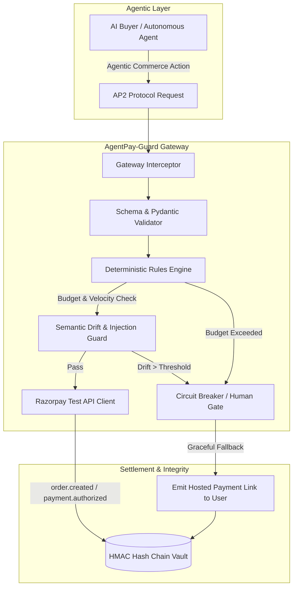

# AgentPay-Guard

```bash
# 1. Start Gateway & Mock Merchant
cd backend && uvicorn app.main:app --reload --port 8000

# 2. Run Adversarial Security Benchmark
PYTHONPATH=. pytest tests/test_adversarial_suite.py -v

# 3. Simulate Agentic Commerce Loop / verify the audit chain
PYTHONPATH=. python -m app.agent.graph
PYTHONPATH=. python -m app.db.crypto_vault --verify-chain
```



AgentPay-Guard is a zero-trust gateway for agentic commerce. A shopping agent proposes an order, then the gateway validates deterministic payment invariants, verifies an AP2 mandate, checks semantic intent and lexical category drift, and either blocks, escalates to a human, or dispatches to Razorpay test mode. Every decision is hash-chained in SQLite.

## Demo flow

The dashboard runs with `cd frontend && npm run dev`. Use the demo API key from `.env.example` for local requests. A clean autonomous purchase can use `Buy compact mechanical keyboard within 2000`; higher-value actions become expiring hosted payment links requiring human approval. Poisoned SKUs are blocked and borderline substitutions can be approved in the dashboard. The machine-readable catalog is available at `/.well-known/agent-catalog.json`.

The dashboard keeps a browser session ID, so repeated approved orders share the cumulative session cap. The gateway also enforces a UTC daily cap. Blocked and pending orders do not consume spend; only dispatched orders reserve it atomically. Bounded actions create an expiring Razorpay Payment Link when test credentials are configured, or a clearly marked local demo fallback otherwise.

## Architecture

The request path is: schema and currency/budget/merchant/replay checks -> AP2 signature verification -> semantic guard -> deterministic lexical category drift -> block, human approval, or Razorpay order -> audit event. See [docs/ARCHITECTURE.md](docs/ARCHITECTURE.md).

## Evaluation

The 64-case adversarial suite covers prompt injection, currency arbitrage, mandate forgery, quantity manipulation, replay, and category/regex evasion. It reports clean blocks, escalations, false allows, false blocks, latency, and economic impact rather than treating every escalation as a failure. See [docs/EVALUATION_REPORT.md](docs/EVALUATION_REPORT.md) and run `cd backend && PYTHONPATH=. pytest tests/test_adversarial_suite.py -v -s`.

## Deployment

The repository includes [render.yaml](render.yaml) for the backend and [frontend/vercel.json](frontend/vercel.json) for the dashboard. Set `OPENROUTER_API_KEY`, Razorpay test keys, `ALLOWED_ORIGINS`, `VITE_API_BASE_URL`, and production spend limits in the platform secret/environment settings. SQLite is suitable for this demo; use a managed database and a real authentication layer for production.

## Known limitations

- The demo API protects payment mutations with a shared `X-AgentPay-Key`; add identity, authorization, and per-user session ownership before production use.
- The semantic guard and agent default to a free, rate-limited OpenRouter model. Guard outages fail closed to human approval, but a recorded demo should use a pinned, provisioned model or offline fixtures.
- CORS is restricted to `ALLOWED_ORIGINS`; the local default is `http://localhost:5173`.
- `vector_drift.py` is intentionally a deterministic lexical category guard. It does not claim to calculate embedding/vector distance.
